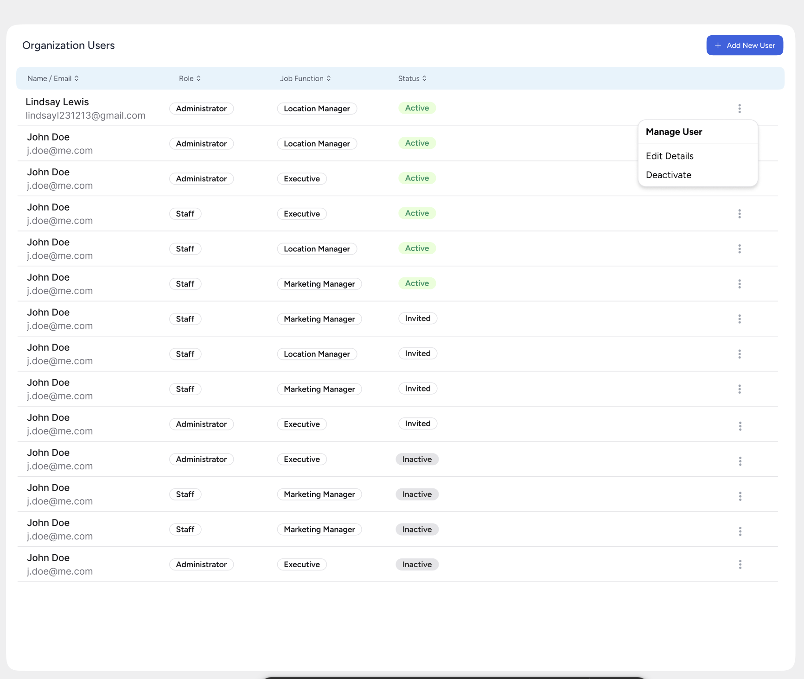
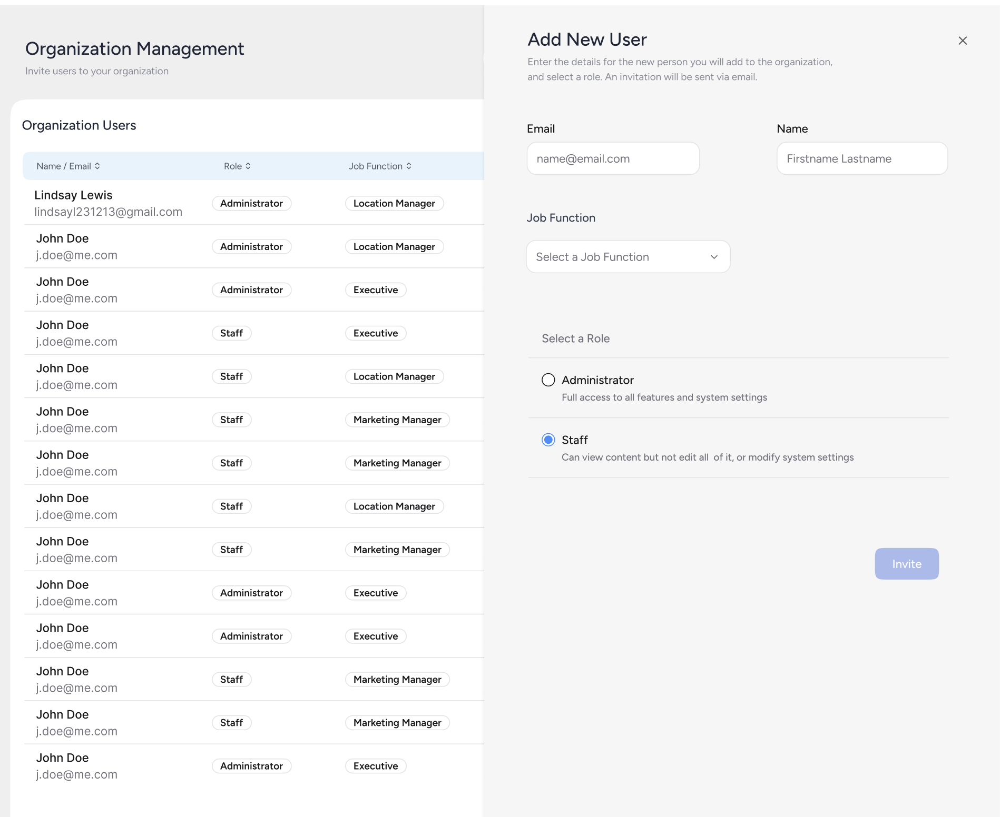

# Technical Challenge - User Management System

## Overview
Develop a user management system that allows creating, viewing, editing, and deleting (CRUD) users in an organization.

## Main Features

### 1. User Listing
The listing interface should follow the model below:

- Display user list with columns:
  - Name/Email
  - Role
  - Job Function
  - Status
- Implement "Add New User" button at the top of the list
- Each user should have an actions menu (three dots)

### 2. User Registration
The registration form should follow the model below:

Form with the following fields:

#### Name
- Required field
- Minimum 3 characters
- Letters and spaces only

#### Email
- Required field
- Valid email format
- Must be unique in the system

#### Role
- Single selection required
- Options:
  - Administrator (Full access)
  - Staff (Limited access)

#### Job Function
- Multiple selection allowed
- Options:
  - Executive
  - Location Manager
  - Marketing Manager

#### Status
- Default value: "Active"
- Options:
  - Active
  - Inactive
  - Invited (automatic status for new invites)

### 3. User Edition

#### Actions Menu
When clicking the three dots button, display:
- Edit Details
- Deactivate/Activate

#### Edition Rules
- Name and email cannot be edited
- Allowed to edit:
  - Role
  - Job Function
  - Status

#### Activation/Deactivation
- Button toggles between "Activate" and "Deactivate"

## Technology Suggestions

### Frontend
- **React Query**

- **Styling**
  - Tailwind CSS for base styling
  - shadcn/ui for reusable components
  - Consistent design system
  - Accessible components

### Backend
- **Next.js API**
  - Freedom to choose between:
    - API Routes
    - Server Actions
    - Server Components

### Database
Flexibility in choice, some suggestions:
- SQLite for local persistence
- JSON Server for API mocking
- In-memory database (like array/object)
- Prisma + PostgreSQL/MongoDB (for a more robust solution)

### Extra
- Docker
- Automated tests

Note: These are just suggestions of technologies that can facilitate development but are not mandatory. The candidate has the freedom to choose the tools they deem most appropriate, as long as they meet the specified functional requirements.

### How to deliver
- Create a public repository on GitHub and send the link to us
- Add some instructions on how to run the project would be great!